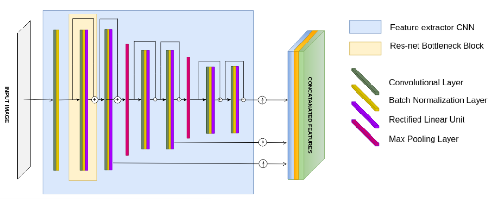
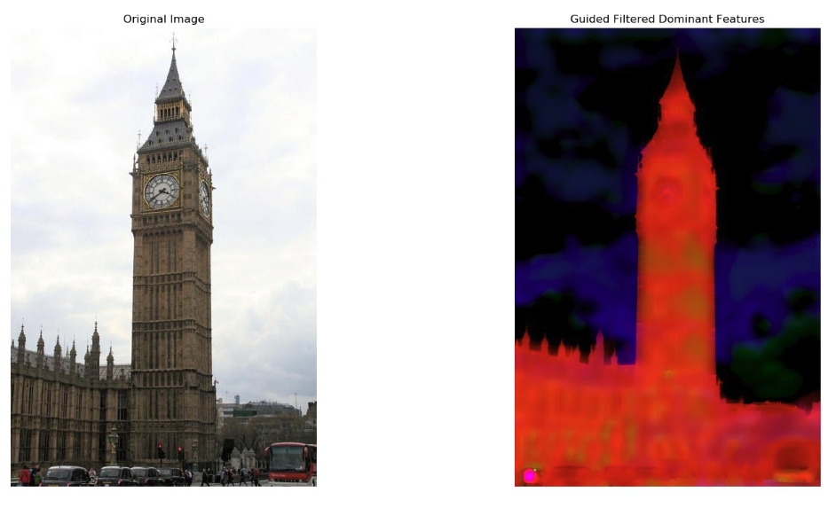
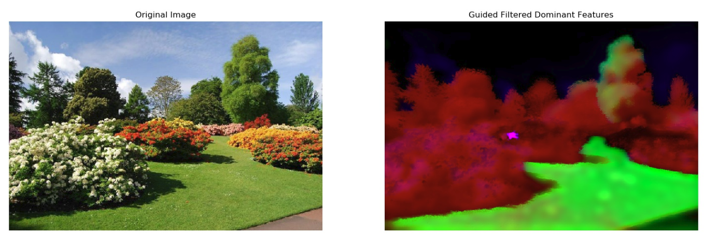

### Fast Semantic Feature Extraction using Superpixels for Soft Segmentation
#### Introduction
Pre-print of our paper accepted in conference CVIP-2019 can be found [here](https://drive.google.com/file/d/1XDNzcknvJs_xO96jLBLv6vbBOUP65KJ9/view?usp=sharing). In this work, We design an end-to-end trainable network and give a detailed comparison of two deep metric learning methods: pixel-based and superpixel-based. We show that huge computational overhead can be reduced by learning the metric based on superpixels. This also conserves the global semantic context of the image, which is lost in pixel-wise computation because of the sampling to reduce comparisons.
   
<p align="center">
    
    
</p>
Our method has the following steps: Feature extractor CNN, which extracts the feature map with the weights of kernels learned during training. We over-segment the input image to obtain superpixels (using SLIC) and define a mapping function on the extracted feature map to determine feature descriptor for every superpixel. We employ a modified form of N-pair loss on these superpixels to update the weights of the network.


#### Dependencies
This code has been tested on :
```
* Python 3.7
* Pytorch 1.3.0
```

#### Data
Download the ADE20K scene parsing dataset in working directory as follows :
```
mkdir data
cd data
aria2c -x 12 http://data.csail.mit.edu/places/ADEchallenge/ADEChallengeData2016.zip
aria2c -x 12 http://data.csail.mit.edu/places/ADEchallenge/release_test.zip
unzip ADEChallengeData2016.zip
unzip release_test.zip
```

#### Training
Once data is downloaded in data folder, simply run ```train.py``` script to start training. Update ```num_spix``` , ``` batch_size``` and other parameters in ```trainer()``` init function.

```
gedit config.py     # Set Data Path correctly if unzipped elsewhere
gedit train.py      # Set parameters in trainer().__init__(self) function
### Start Training ### 
python train.py
```

#### Demo
Put any image in ```demo_im``` folder and simply run ```demo.py``` script with argument as image name. Result will appear in ```Results_demo``` folder. Note that ```saved_model``` has ```LatestSavednet.pth``` file in it for demo to run correctly. 

```
python demo.py tower.jpg
```

<p align="center">
    <br>
    

    
</p>

#### Authors
```
- Shashikant Verma (IIT Gandhinagar)
- Rajendra Nagar (IIT Jodhpur)
- Shanmuganathan Raman (IIT Gandhinagar)
```

#### Contact
e-mail: shashikant.verma@iitgn.ac.in

